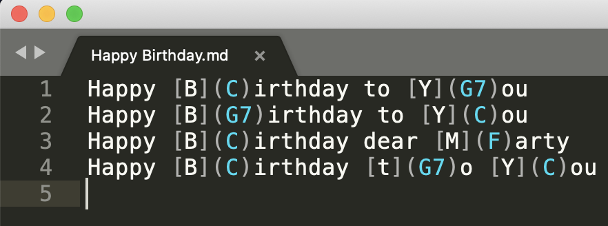
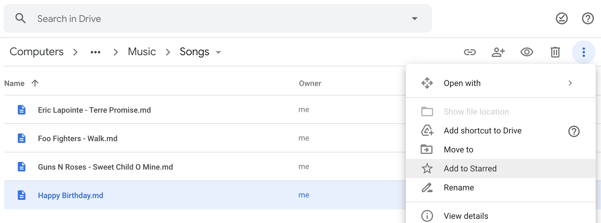
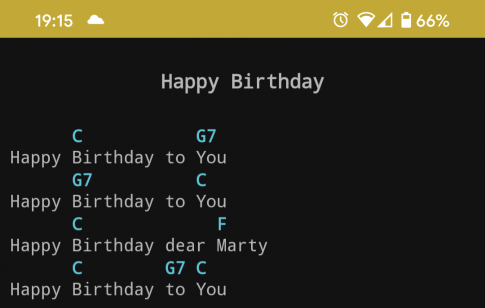

    

# Repertoire

Create your music chord files using a Markdown-like syntax and render them on your Android devices.

## Usage

1. Transcribe (or write) your song\*. 
1. Share the file with your cell phone, for instance using Google Drive. **Tips:** *star* your songs to find them more easily! 
1. Use the app to render your song. That's it, you're ready to rock! 😎 

\* *Note that the characters `{` and `}` are reserved for future features.*
